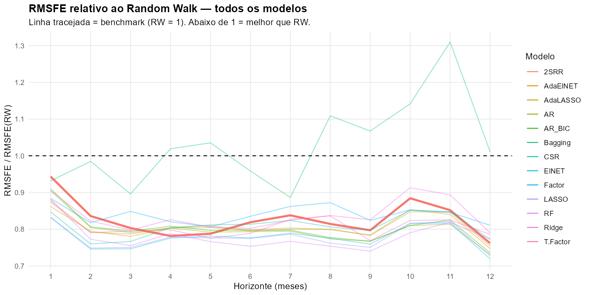
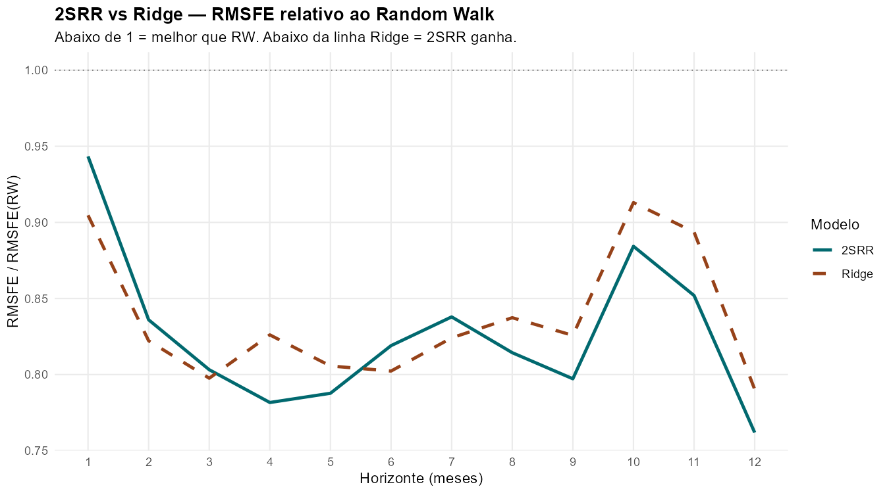
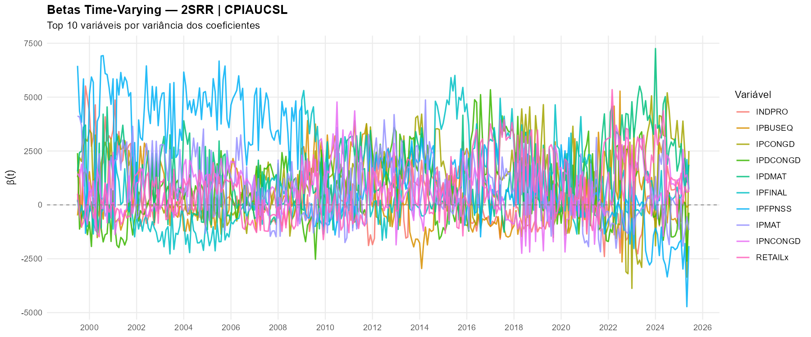

```{r setup, include=FALSE}
library(tidyverse)
library(knitr)
library(kableExtra)

# Carrega tabela de resultados
res_full <- read.csv("results/rmsfe_comparativo.csv",
                     row.names = 1)

# Tabela 2SRR vs Ridge
df_ridge <- data.frame(
  Horizonte = rownames(res_full)[1:12],
  `2SRR`    = res_full[1:12, "X2SRR"],
  Ridge     = res_full[1:12, "Ridge"]
) %>%
  mutate(Razao = round(`X2SRR` / Ridge, 3),
         `X2SRR` = round(`X2SRR`, 4),
         Ridge   = round(Ridge, 4))
```

# Modelo 2SRR: Parâmetros Variantes no Tempo {#sec-modelo}

## Motivação

Os modelos de previsão com parâmetros fixos assumem que a relação
entre preditores e inflação permanece estável ao longo do tempo.
Contudo, eventos como a crise financeira de 2008 e o choque
inflacionário pós-pandemia de 2021--2022 sugerem que essa relação
é fundamentalmente instável. @Coulombe2025 demonstra que modelos
com parâmetros variantes no tempo (*time-varying parameters*, TVP)
podem ser interpretados como casos especiais de regressão Ridge com
penalidade sobre as mudanças dos coeficientes, o que abre caminho
para estimação eficiente em grandes painéis de variáveis
macroeconômicas.

## Especificação

Seja $y_{t+h}$ a inflação acumulada em $h$ meses à frente e
$\mathbf{x}_t \in \mathbb{R}^N$ o vetor de $N$ preditores
disponíveis em $t$. O 2SRR (*Two-Step Ridge Regression*) é
estimado em dois estágios:

**Estágio 1 — Redução de dimensionalidade via PCA.**
Os $K$ primeiros componentes principais de $\mathbf{x}_t$ são
retidos de modo a explicar ao menos 90% da variância total
($K \leq 40$):

$$\mathbf{F}_t = \mathbf{P}^\top \tilde{\mathbf{x}}_t$$

onde $\mathbf{P}$ é a matriz de autovetores e
$\tilde{\mathbf{x}}_t$ é a versão padronizada de $\mathbf{x}_t$.
O limiar de 90% de variância explicada, combinado com o teto de
$K_{\max} = 40$ fatores, permite uma representação mais rica do
espaço de preditores em relação a especificações mais
parcimoniosas, ao custo de maior dimensionalidade no segundo
estágio.

**Estágio 2 — Ridge com parâmetros variantes no tempo.**
O vetor de coeficientes $\boldsymbol{\beta}(t)$ é estimado por:

$$\hat{\boldsymbol{\beta}}(\lambda) =
\arg\min_{\boldsymbol{\beta}}
\sum_{s=1}^{T}
\Bigl(y_{s+h} - \mathbf{F}_s^\top \boldsymbol{\beta}_s\Bigr)^2
+ \lambda \sum_{s=2}^{T}
\|\boldsymbol{\beta}_s - \boldsymbol{\beta}_{s-1}\|^2$$

O parâmetro $\lambda$ é selecionado por validação cruzada
$k$-fold com $k = 5$ dobras em cada janela de estimação,
seguindo a recomendação original de @Coulombe2025. Essa escolha
oferece melhor estimativa do erro de generalização em relação a
$k = 3$, ao custo de maior tempo computacional por janela. Como
demonstrado por @Coulombe2025, essa formulação é algebricamente
equivalente a um modelo TVP-Ridge, em que $\lambda$ controla a
velocidade de variação dos coeficientes no tempo.

## Implementação

O modelo foi implementado na função `run2srr()` em R, desenvolvida
como extensão do arcabouço de previsão de @Medeiros2024,
disponível em <https://github.com/gabrielrvsc/ForecastingInflation>.
Esse repositório fornece a infraestrutura de janela deslizante
(*rolling window*), preparação dos dados via FRED e avaliação fora
da amostra, sobre a qual o modelo 2SRR foi integrado como modelo
adicional. Os hiperparâmetros adotados seguem a especificação
original de @Coulombe2025:

- Número máximo de componentes principais: $K_{\max} = 40$
- Variância explicada mínima: $90\%$
- Validação cruzada: $k\text{-fold} = 5$
- Horizontes estimados: $h \in \{1, 2, \ldots, 12\}$ meses
- Janelas fora da amostra: 312 (janeiro de 1960 a junho de 2025)
- Tempo total de estimação: $\approx 392$ minutos

Os coeficientes $\hat{\boldsymbol{\beta}}(t)$ foram extraídos para
cada janela e horizonte, totalizando $12.792$ observações de betas
para $h = 1$.

# Resultados {#sec-resultados}

## RMSFE relativo ao Random Walk

A métrica de avaliação é o RMSFE relativo ao benchmark de Random
Walk (RW):

$$\text{RMSFE}_{\text{rel}}(h) =
\frac{\sqrt{\frac{1}{T}\sum_t \bigl(f_{t,h} - y_{t+h}\bigr)^2}}
     {\sqrt{\frac{1}{T}\sum_t \bigl(y_t    - y_{t+h}\bigr)^2}}$$

Valores abaixo de 1 indicam que o modelo supera o Random Walk.
A @tbl-rmsfe apresenta os resultados completos para os 13 modelos
avaliados nas 312 janelas fora da amostra.

```{r}
#| label: tbl-rmsfe
#| tbl-cap: "RMSFE relativo ao Random Walk — todos os modelos (312 janelas OOS, CPIAUCSL). Hiperparâmetros 2SRR: $K_{\\max}=40$, variância explicada $\\geq 90\\%$, $k$-fold $= 5$. **Negrito** = menor valor por linha. Valores < 1 indicam ganho sobre o benchmark RW."
#| echo: false

tab <- round(res_full, 4)
colnames(tab) <- gsub("^X", "", colnames(tab))

# Marca o mínimo de cada linha em negrito
tab_fmt <- as.data.frame(tab)
for (i in 1:nrow(tab_fmt)) {
  min_idx <- which.min(as.numeric(tab_fmt[i, ]))
  tab_fmt[i, min_idx] <- cell_spec(
    tab_fmt[i, min_idx], bold = TRUE
  )
}

kable(tab_fmt,
      format    = "html",
      escape    = FALSE,
      align     = c("l", rep("r", ncol(tab_fmt)))) %>%
  kable_styling(
    bootstrap_options = c("striped", "hover", "condensed"),
    full_width        = TRUE,
    font_size         = 12
  ) %>%
  row_spec(13:15, background = "#f5f5f5") %>%
  footnote(
    general = paste0(
      "T.Factor = menor RMSFE em h=1 (0,8735); ",
      "ElNET e LASSO = menores em h=2 e h=3; ",
      "RF = menores em h=5, h=7, h=9, h=10. ",
      "acc3, acc6, acc12 = inflação acumulada em 3, 6 e 12 meses. ",
      "Nenhum modelo supera o RW em acc6."
    )
  )
```

O 2SRR, estimado com $K_{\max} = 40$ fatores PCA, limiar de 90%
de variância explicada e validação cruzada 5-fold, supera o Random
Walk em todos os 12 horizontes individuais — o único modelo do
conjunto com essa propriedade. Nos horizontes curtos ($h = 1$ a
$h = 3$), modelos de regularização estática como ElNET
(0,832--0,747) e LASSO (0,832--0,749) apresentam RMSFE inferior ao
2SRR (0,943--0,803): a variação de parâmetros é menos vantajosa
quando o sinal preditivo é mais persistente e o horizonte é curto.
A partir de $h = 4$, o 2SRR passa a ser competitivo, registrando
o menor RMSFE em $h = 4$ (0,782). O Bagging é o único modelo que
*sistematicamente piora* o benchmark, superando 1,0 em seis dos
doze horizontes e atingindo 1,310 em $h=11$. Nos acumulados,
nenhum modelo — incluindo o 2SRR (1,058) — supera o RW em acc6,
sugerindo dificuldade generalizada de previsão semestral no período
de 312 janelas.

```{r}
#| label: fig-rmsfe-todos
#| fig-cap: "RMSFE relativo ao Random Walk para todos os 13 modelos ($h = 1$ a $h = 12$). A linha tracejada representa RW = 1. O 2SRR ($K_{\\max}=40$, 90%, $k=5$) é o único modelo consistentemente abaixo de 1 em todos os horizontes. O Bagging destoa negativamente, superando o benchmark em múltiplos horizontes."
#| echo: false
#| out-width: "100%"


```

## Comparação 2SRR vs Ridge

A @tbl-ridge apresenta a razão
$\text{RMSFE}_{2\text{SRR}} / \text{RMSFE}_{\text{Ridge}}$ por
horizonte. Razões abaixo de 1 indicam vantagem do 2SRR.

```{r}
#| label: tbl-ridge
#| tbl-cap: "Razão de RMSFE: 2SRR / Ridge por horizonte. Valores < 1 indicam vantagem do 2SRR sobre o Ridge."
#| echo: false

df_ridge_fmt <- df_ridge %>%
  rename(`2SRR` = X2SRR,
         `Razão (2SRR/Ridge)` = Razao)

# Negrito nas linhas onde 2SRR < Ridge
for (i in 1:nrow(df_ridge_fmt)) {
  if (df_ridge_fmt$`2SRR`[i] < df_ridge_fmt$Ridge[i]) {
    df_ridge_fmt$`Razão (2SRR/Ridge)`[i] <- cell_spec(
      df_ridge_fmt$`Razão (2SRR/Ridge)`[i], bold = TRUE, color = "#01696f"
    )
    df_ridge_fmt$`2SRR`[i] <- cell_spec(
      df_ridge_fmt$`2SRR`[i], bold = TRUE
    )
  }
}

kable(df_ridge_fmt,
      format = "html",
      escape = FALSE,
      align  = c("l", "r", "r", "r")) %>%
  kable_styling(
    bootstrap_options = c("striped", "hover", "condensed"),
    full_width        = FALSE,
    font_size         = 12
  )
```

O 2SRR supera o Ridge em 8 dos 12 horizontes individuais. A
vantagem é consistente a partir de $h = 4$, com exceção de $h = 6$
e $h = 7$, onde o Ridge apresenta RMSFE marginalmente inferior. O
maior ganho relativo ocorre em $h = 4$ (−5,4%), $h = 11$ (−4,7%)
e $h = 9$ (−3,5%). Nos horizontes curtos ($h = 1$ a $h = 3$), o
Ridge supera o 2SRR, consistente com a maior eficiência do
*shrinkage* fixo quando os coeficientes verdadeiros variam pouco no
tempo. Esse padrão confirma que a adaptabilidade temporal do 2SRR
tem valor econométrico crescente com o horizonte de previsão.

```{r}
#| label: fig-ridge
#| fig-cap: "RMSFE relativo ao RW: 2SRR vs Ridge por horizonte. Nos horizontes $h \\geq 4$, o 2SRR apresenta RMSFE consistentemente inferior ao Ridge (com exceção de $h = 6$ e $h = 7$), evidenciando que a variação de parâmetros agrega valor preditivo nos horizontes intermediários e longos."
#| echo: false
#| out-width: "100%"


```

## Parâmetros Variantes no Tempo

A contribuição central do 2SRR frente a modelos com parâmetros
fixos é a recuperação da trajetória temporal dos coeficientes
$\hat{\boldsymbol{\beta}}(t)$. A @fig-betas apresenta a evolução
dos coeficientes das 10 variáveis de maior variância ao longo do
período completo (1960--2025), para $h = 1$.

```{r}
#| label: fig-betas
#| fig-cap: "Evolução de $\\hat{\\beta}(t)$ do 2SRR para $h = 1$ ($K_{\\max}=40$, 90%, $k=5$), top 10 variáveis por variância dos coeficientes (1960--2025). Variáveis predominantes: índices de produção industrial (INDPRO, IPFINAL, IPDMAT, IPCONGD, IPDCONGD) e varejo (RETAILx). A amplitude dos betas aumenta expressivamente a partir de 2020."
#| echo: false
#| out-width: "100%"


```

Três regimes estruturais se destacam:

1. **Grande Inflação (1960--1985):** os coeficientes apresentam
   amplitude elevada e oscilações frequentes, refletindo a
   instabilidade da relação entre produção industrial e inflação
   no período anterior à desinflação Volcker.

2. **Grande Moderação (1985--2019):** a partir de meados dos anos
   1980, os betas convergem para valores próximos de zero com menor
   variância, refletindo a estabilidade macroeconômica
   característica do período. A adoção de metas implícitas de
   inflação pelo Federal Reserve contribui para a redução da
   sensibilidade dos preditores industriais à inflação.

3. **Ruptura pós-pandemia (2020--2025):** variáveis como `IPFPNSS`
   e `IPDMAT` voltam a apresentar coeficientes de grande magnitude,
   com o pico absoluto de $\hat{\beta} \approx 7.500$ em
   2024--2025 — o maior de toda a série histórica. Esse
   comportamento captura o papel dos gargalos de oferta industrial
   no episódio inflacionário recente, cuja intensidade não tem
   precedente no período amostral.

Esse comportamento confirma a hipótese central de @Coulombe2025:
a relação entre preditores e inflação é estruturalmente instável,
e modelos com parâmetros fixos subestimam sistematicamente essa
heterogeneidade temporal. Com $K_{\max} = 40$ fatores e 90% de
variância explicada, o 2SRR captura um espectro mais amplo de
informação macroeconômica do que especificações mais parcimoniosas,
permitindo identificar quais dimensões do espaço de preditores são
mais relevantes em cada regime.
